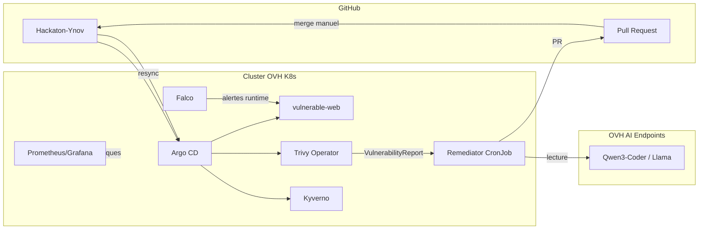

# Architecture — Boucle d'audit et remédiation GitOps

## Vue d'ensemble

## Rôle de chaque brique

| Composant | Rôle |
|---|---|
| **Argo CD** | GitOps : déploie tout depuis le repo, app-of-apps `root` |
| **vulnerable-web** | Cible de démo (nginx:1.14, privileged, root, sans limits) |
| **Trivy Operator** | Scan d'images → CRD `VulnerabilityReport` |
| **Kyverno** | Policies en mode `Audit` (privileged, limits, :latest) |
| **kube-prometheus-stack** | Observabilité (Prometheus + Grafana) |
| **Falco** | Détection runtime (eBPF, accès fichiers sensibles) |
| **Remediator** | Lit Trivy, appelle l'IA, ouvre une PR — **sans droits d'écriture cluster** |

## Choix techniques

### Trivy vs Kubescape

**Trivy Operator** retenu : intégration native Kubernetes (CRD `VulnerabilityReport`), déploiement Helm simple via Argo CD, rapports par workload. Kubescape offre une vision posture cluster plus large mais ajoute de la complexité pour un hackathon solo.

### Script vs opérateur custom

Un **script Python + CronJob** suffit : le remédiateur n'a pas besoin d'un controller Kubernetes dédié. L'opérateur custom serait justifié pour une boucle temps-réel multi-tenant, hors scope hackathon.

## Flux de remédiation

1. Trivy détecte des CVE sur `vulnerable-web`
2. Le remediator résume le rapport et lit le manifeste GitHub
3. OVH AI Endpoints propose un YAML corrigé
4. Validation dry-run → ouverture PR (`fix/ai-remediation-<CVE>`)
5. **Revue humaine + merge manuel**
6. Argo CD resync → nouveau pod → Trivy rescan

## Limites connues

- L'IA peut proposer un YAML syntaxiquement valide mais fonctionnellement incorrect
- Le dry-run serveur ne couvre pas tous les cas (admission webhooks, quotas)
- Falco eBPF peut ne pas couvrir tous les runtimes managés
- Le remediator ne corrige qu'un manifeste à la fois (`deployment.yaml`)
- Pas de rollback automatique si la correction dégrade l'application
